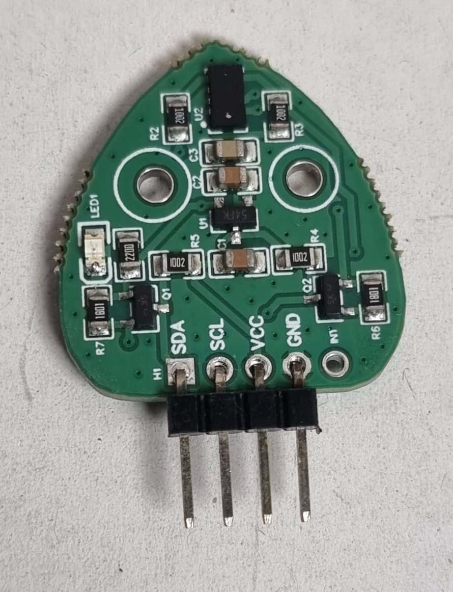
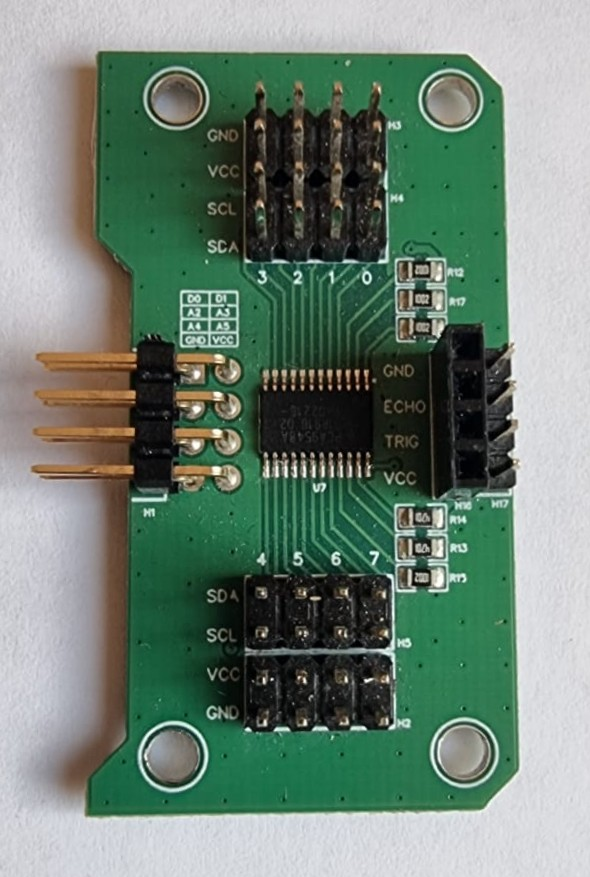

# 9.1 Materiaal

Een **Time of Flight (TOF) sensor** meet afstand met een lichtstraal. Hij is preciezer dan een ultrasone sensor en werkt ook bij geluid. De TOF praat over **I2C**, dus via de pinnen **SDA** en **SCL**.

Wat heb je nodig?

- Arduino Nano RP2040 Connect
- Time of Flight-sensor
- **Voor 2 of meer TOF-sensoren** ook: SDA/SCL-module voor het Leaphy Murphy Shield (een multiplexer)

## Time of Flight-sensor

## SDA/SCL-module (multiplexer)

Controlevraag

Waarom heb je een multiplexer nodig bij **meerdere** TOF-sensoren?

Antwoord

Alle TOF-sensoren hebben hetzelfde **I2C-adres**. De microcontroller zou ze niet uit elkaar kunnen houden. Met een multiplexer geef je elke sensor een eigen **channel**, zodat je ze los kunt aanspreken.

