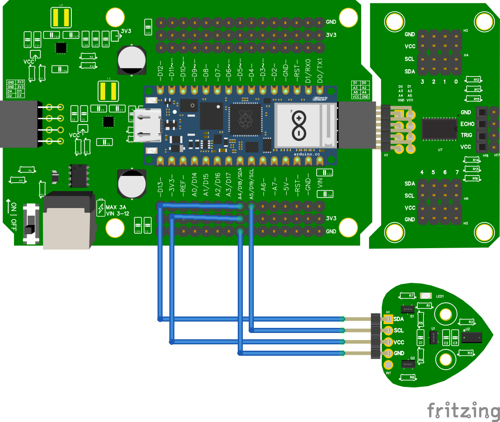

# 9.2 Eén TOF zonder multiplexer

## Aansluiten



- **VCC** van de TOF aan **3.3V**
- **GND** van de TOF aan **GND**
- **SDA** van de TOF aan **A4** (SDA)
- **SCL** van de TOF aan **A5** (SCL)

:::tip Beschermend stickertje

Op een nieuwe TOF zit vaak een doorzichtig plastic stickertje. Trek dat er voorzichtig af voor een betere meting.

:::

## Code

```python
from leaphymicropython.sensors.tof import TimeOfFlight
from time import sleep

tof = TimeOfFlight()

while True:
    afstand = tof.get_distance()
    print(afstand)
    sleep(1)
```

## Uitleg

- `TimeOfFlight()` maakt een sensor aan op het standaard I2C-adres.
- `tof.get_distance()` geeft de afstand in **millimeters**.

<details>
<summary>Controlevraag</summary>

Wat krijg je terug als er **niets** voor de sensor staat?

</details>

<details>
<summary>Antwoord</summary>

Het getal **8191**. Dat betekent: geen geldige meting. Je krijgt het ook als een object te ver weg is of juist te dichtbij (onder ongeveer **5 cm**). De TOF meet betrouwbaar tussen ongeveer **5 cm** en **200 cm**.

</details>

## Alleen geldige metingen

Soms staat er niets voor de sensor, of zit een object buiten bereik. Dan krijg je een hoog getal terug. De regel is simpel: **alles boven 8090 is geen echte afstand**.

```python
from leaphymicropython.sensors.tof import TimeOfFlight
from time import sleep

tof = TimeOfFlight()

while True:
    afstand = tof.get_distance()
    if afstand > 8090:
        print("geen geldige meting")
    else:
        print(afstand)
    sleep(1)
```

- Een echte afstand is een getal tussen **0** en ongeveer **8090** (in millimeters).
- Is het getal **groter dan 8090**? Dan is er geen geldig object: te ver, te dichtbij, niets ervoor, of een storing.

<details>
<summary>Controlevraag</summary>

Wat zie je in de Shell als je je hand vlak (minder dan 5 cm) voor de sensor houdt?

</details>

<details>
<summary>Antwoord</summary>

`geen geldige meting`. Onder ongeveer 5 cm geeft de TOF `8191`, en dat is groter dan 8090.

</details>
