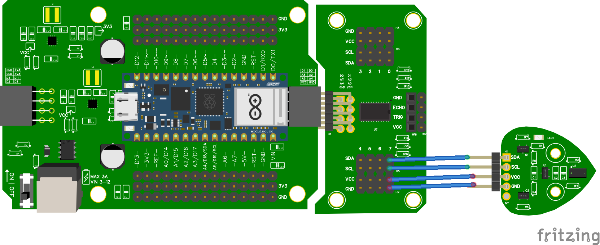

# 9.3 Eén TOF met multiplexer

Met de SDA/SCL-module kun je tot acht I2C-apparaten aansluiten op **channels 0 t/m 7**. Elke sensor krijgt zo zijn eigen kanaal.

## Aansluiten



In dit voorbeeld zit de TOF op **channel 7** van de multiplexer. Het cijfer staat boven het stel pinnen waarin je de sensor steekt.

## Code

```python
from leaphymicropython.sensors.tof import TimeOfFlight
from time import sleep

tof = TimeOfFlight(channel=7)

while True:
    print(tof.get_distance())
    sleep(1)
```

## Uitleg

```python
TimeOfFlight(channel=7)
```

Met `channel=7` vertel je de bibliotheek op welk kanaal van de multiplexer de sensor zit. Vergeet niet dit aan te passen als je de sensor in een ander kanaal steekt.

<details>
<summary>Controlevraag</summary>

Welk getal vul je in bij `channel=` als je de sensor in het stel pinnen onder **0** steekt?

</details>

<details>
<summary>Antwoord</summary>

`channel=0`. Het cijfer boven het stel pinnen op de multiplexer is precies het kanaal dat je in je code invult.

</details>
