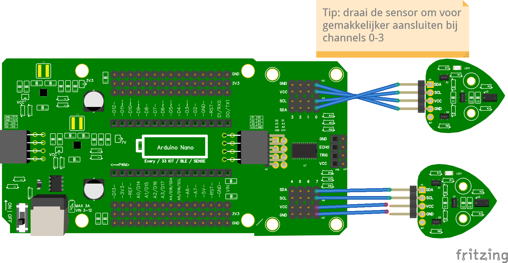

# 9.4 Twee of meer TOFs met multiplexer

Heb je twee TOFs nodig (bijvoorbeeld om links en rechts te meten)? Dan steek je ze in twee verschillende channels van de multiplexer.

## Aansluiten



In dit voorbeeld:

- TOF 1 op **channel 0**
- TOF 2 op **channel 7**

## Code

```python
from leaphymicropython.sensors.tof import TimeOfFlight
from time import sleep

tof_0 = TimeOfFlight(channel=0)
tof_7 = TimeOfFlight(channel=7)

while True:
    afstand_0 = tof_0.get_distance()
    afstand_7 = tof_7.get_distance()
    print(afstand_0, afstand_7)
    sleep(1)
```

In de Shell zie je nu twee getallen naast elkaar: de afstand voor sensor 0 en sensor 7.

<details>
<summary>Opdracht: drie sensoren</summary>

Voeg een derde TOF toe op **channel 3** en print ook die waarde mee.

</details>

<details>
<summary>Oplossing</summary>

```python
from leaphymicropython.sensors.tof import TimeOfFlight
from time import sleep

tof_0 = TimeOfFlight(channel=0)
tof_3 = TimeOfFlight(channel=3)
tof_7 = TimeOfFlight(channel=7)

while True:
    print(tof_0.get_distance(), tof_3.get_distance(), tof_7.get_distance())
    sleep(1)
```

</details>
