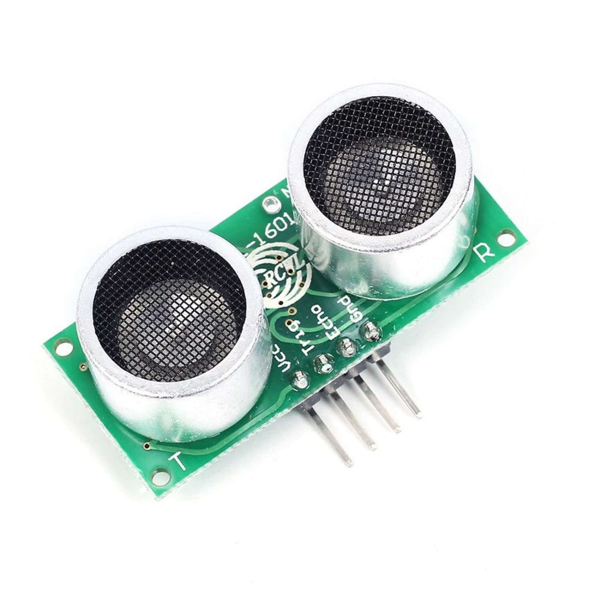

# 8.1 Materiaal

Een **ultrasone afstandssensor** meet hoe ver iets weg is door geluidsgolven te sturen en te kijken hoe lang ze erover doen om terug te komen. Wij gebruiken de **RCWL-1601**.

Wat heb je nodig?

1. Arduino Nano RP2040 Connect
2. Afstandssensor type **RCWL-1601**

De sensor heeft vier pinnen: **VCC**, **Trig**, **Echo** en **GND**.

Controlevraag

Wat doet de **Trig**-pin?

Antwoord

Via **Trig** stuurt de microcontroller een kort signaaltje. Daardoor zendt de sensor een geluidspuls uit. Via **Echo** komt het antwoord terug.

