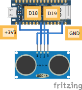

# 8.2 Aansluiten en code

## Aansluiten




- **VCC** van de sensor aan **3.3V**
- **GND** van de sensor aan **GND**
- **Trig** aan een digitale pin, bijvoorbeeld **D19**
- **Echo** aan een digitale pin, bijvoorbeeld **D18**

## Code

```python
from time import sleep
from leaphymicropython.sensors.sonar import read_distance

while True:
    print(read_distance(19, 18))
    sleep(1)
```

Je krijgt nu elke seconde de afstand in **centimeters** in de Shell te zien.

## Uitleg

```python
read_distance(19, 18)
```

- Eerste getal: pin van **Trig** (`D19`).
- Tweede getal: pin van **Echo** (`D18`).

<details>
<summary>Opdracht: lampje bij obstakel</summary>

Laat het ingebouwde rode lampje **`LED_RED`** branden zodra een obstakel binnen **10 cm** komt.

</details>

<details>
<summary>Tip</summary>

Bij de ingebouwde RGB-LED is `value(0)` aan en `value(1)` uit. Gebruik een `if`-statement met `< 10`.

</details>

<details>
<summary>Oplossing</summary>

```python
from time import sleep
from machine import Pin
from leaphymicropython.sensors.sonar import read_distance

led = Pin('LED_RED', Pin.OUT)

while True:
    afstand = read_distance(19, 18)
    if afstand < 10:
        led.value(0)  # AAN
    else:
        led.value(1)  # UIT
    sleep(0.1)
```

</details>
