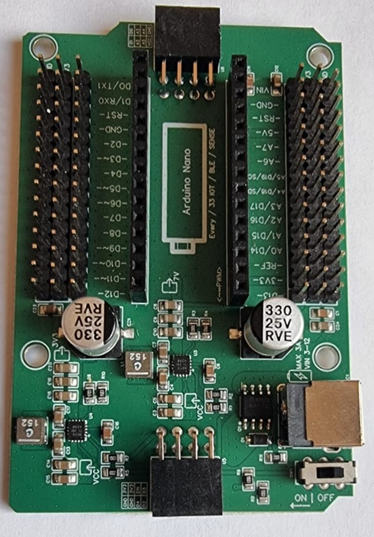

# 11.1 Materiaal

Een **analoge IR-sensor** geeft niet zomaar een 0 of een 1, maar een getal tussen **0 en 65535**. Hoe hoger het getal, hoe minder licht er terugkomt. Daardoor kun je zelf bepalen waar de grens tussen zwart en wit ligt.

Wat heb je nodig?

1. Arduino Nano RP2040 Connect
2. Analoge IR-sensor
3. Leaphy Murphy Shield

## Analoge IR-sensor

## Leaphy Murphy Shield

Controlevraag

Op welke pinnen sluit je een analoge IR-sensor aan?

Antwoord

Op een **analoge pin**: `A0`, `A1`, `A2`, `A3`, `A6` of `A7`. Niet op `A4` en `A5` — die zijn nodig voor I2C (SDA en SCL).

