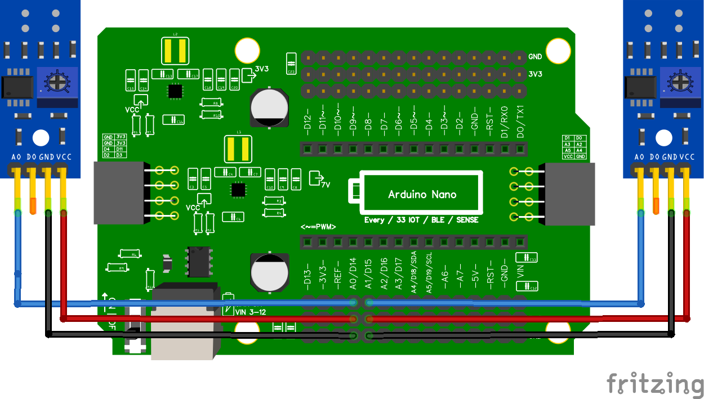

# 11.4 Hoeveel sensoren kan ik aansluiten?

In totaal zijn er **zes** analoge pinnen bruikbaar voor IR-sensoren. Twee is gangbaar voor lijnvolgen, vier is gevorderd.

## Wel gebruiken

**A0, A1, A2, A3, A6, A7**

## Niet gebruiken

**A4 en A5**

:::danger A4 en A5 zijn bezet

Pinnen **A4** en **A5** worden gebruikt voor **I2C communicatie** (SDA en SCL). Als je een multiplexer, TOF-sensor of OLED-scherm gebruikt, zijn deze pinnen al bezet. Sluit hier **geen** IR-sensoren op aan, anders werken je I2C-apparaten niet meer.

:::

Controlevraag

Je gebruikt een OLED-scherm en wilt drie IR-sensoren toevoegen. Welke pinnen kies je?

Antwoord

Kies drie uit **A0, A1, A2, A3, A6, A7**. Bijvoorbeeld **A0**, **A1** en **A2**. **Niet** A4 of A5, want die heeft het OLED-scherm nodig.

