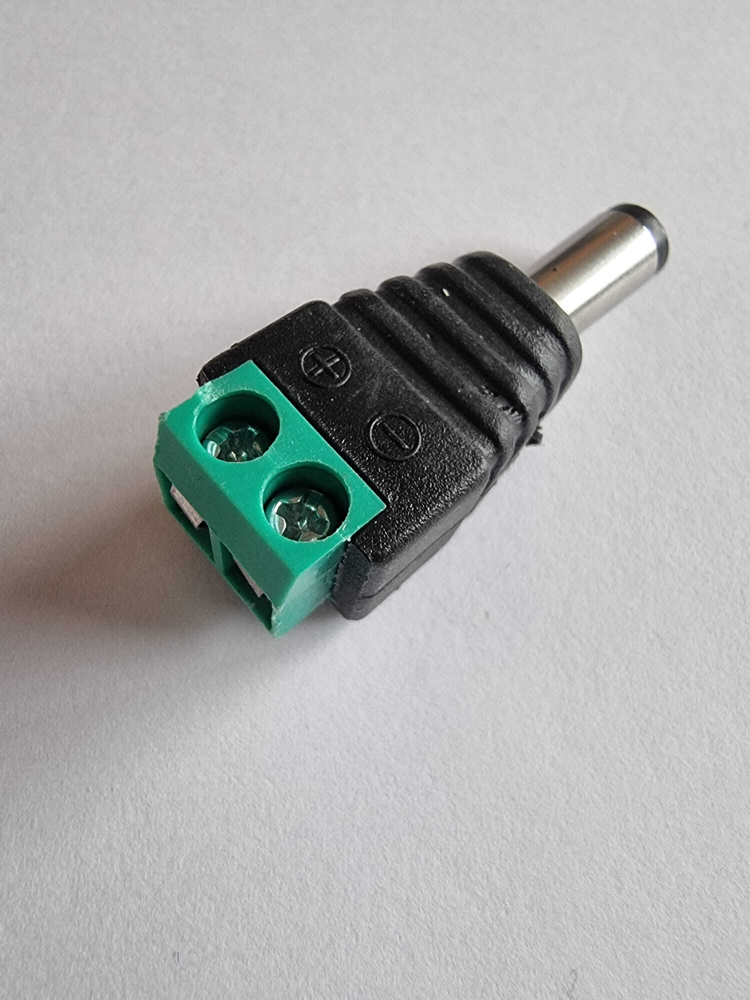

# 14.1 Materiaal

Zonder batterijen moet je robot aan een USB-kabel hangen. Dat wil je natuurlijk niet. Hier zet je een batterijhouder op die zonder kabel werkt.

Verzamel:

| Onderdeel | Aantal | Waarvoor? |
|---|---|---|
| AA-batterij | 6x | Voeding voor de robot |
| Batterijhouder met aan/uit-schakelaar | 1x | Houdt de batterijen bij elkaar |
| Adapter voor Murphy en Delphy Shield | 1x | Verbindt de batterijhouder met het shield |
| Multimeter | 1x | Om de spanning van de batterijen te controleren |

## Adapter voor Murphy en Delphy Shield

Heb je alles?

Controleer of je alle onderdelen uit de tabel hebt liggen voordat je verder gaat.

Controlevraag

Hoeveel volt verwacht je in totaal als je **6 volle AA-batterijen** in serie zet?

Antwoord

Ongeveer **9V**: 6 × 1,5V.

