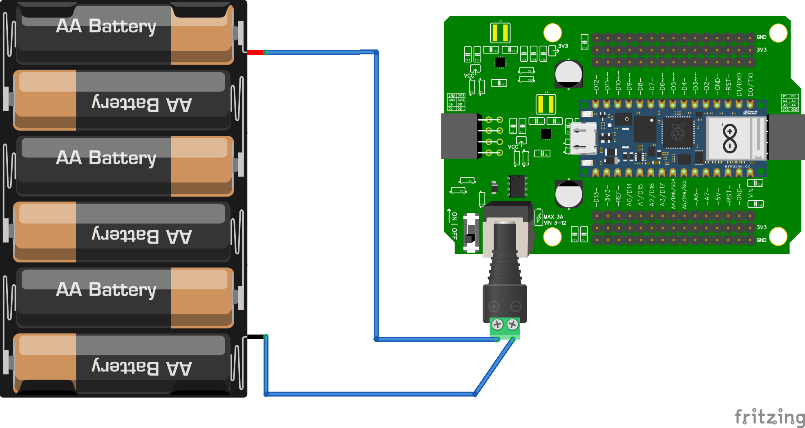

# 14.2 Aansluiten

## Stap 1: meet elke batterij na

Meet met je multimeter (op **DC voltage**) de spanning van iedere AA-batterij.

- **Vol**: ongeveer **1,5V**
- **Te zwak**: minder dan **1,2V** → vervang die batterij

:::tip Nog nooit een multimeter gebruikt?

Kijk eerst even bij [4.1 Pin nameten](../Tutorial-meten%20is%20weten/1_pin_nameten.md).

:::

Welke instellingen heb ik nodig?

Zet de multimeter op **DC voltage** (V met een streepje). Rode meetpen op de plus (+), zwarte meetpen op de min (-). Je leest een waarde rond de 1,5V af.

## Stap 2: meet de batterijhouder na

Plaats alle batterijen in de houder. Meet de spanning aan de **rode en zwarte draad** die eruit komen. Verwacht: ongeveer **9V**.

Ik meet een veel lagere spanning

- Zit elke batterij goed om (let op + en -)?
- Meet elke batterij apart na — misschien is er eentje leeg.
- Zitten de draden van de houder niet los?

## Stap 3: batterijhouder op het shield

Sluit de **rode** draad aan op de plus en de **zwarte** draad aan op de min van het shield (zie afbeelding). Zet daarna de schakelaar op het shield op **ON**.

Als alles goed is, zie je een **groen lampje** op de microcontroller branden.

Het groene lampje brandt niet

- Staat de schakelaar op **ON**?
- Zitten de draden goed vast?
- Meet de batterijhouder opnieuw (Stap 2).

