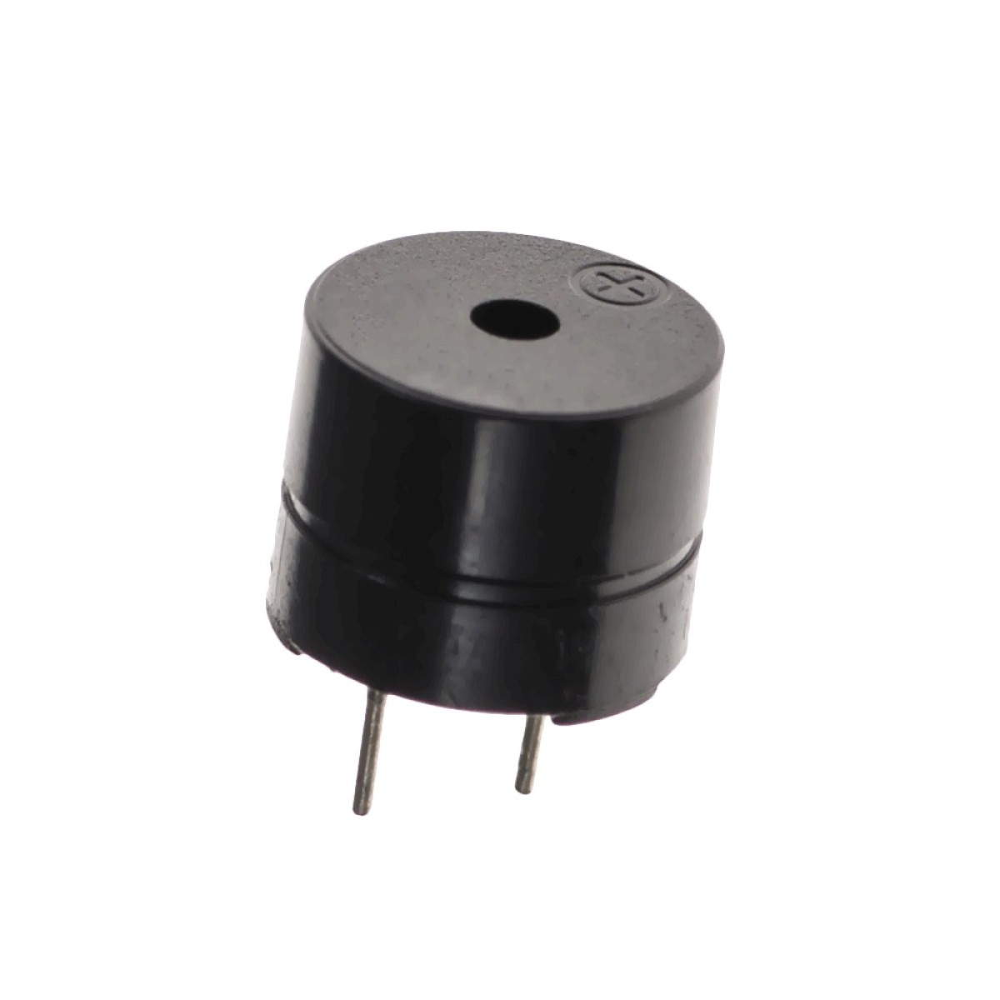

# 5.1 Materiaal

Een **buzzer** is een klein onderdeel dat geluid maakt. Hieronder zie je hoe hij eruitziet.

Wat heb je nodig?

1. Arduino Nano RP2040 Connect
2. Buzzer

De buzzer heeft twee pinnen: een **lange** (de plus, met een `+`-teken) en een **korte** (de min, GND).

Controlevraag

Welke pin van de buzzer gaat naar GND?

Antwoord

De **korte** pin. De **lange** pin (met het `+`-teken) gaat naar een digitale uitgang van de microcontroller.

