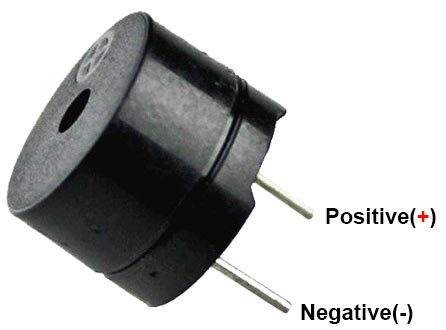

# 5.2 Aansluiten

## Pinnen van de buzzer

- **GND** (lange pin): de min
- **Digital (+)** (korte pin): hier komt het stuursignaal binnen

## Aansluiten op de Nano RP2040 Connect

- **GND** van de buzzer aan een **GND**-pin van het bord
- **Digital (+)** van de buzzer aan een digitale pin naar keuze, bijvoorbeeld **D6**

Controlevraag

Mag je de `+`-pin van de buzzer rechtstreeks aan `3.3V` aansluiten?

Antwoord

Nee. De buzzer moet aan een **digitale pin** zitten, zodat je hem vanuit je code aan en uit kunt zetten. Aan `3.3V` zou hij continu aan staan.

