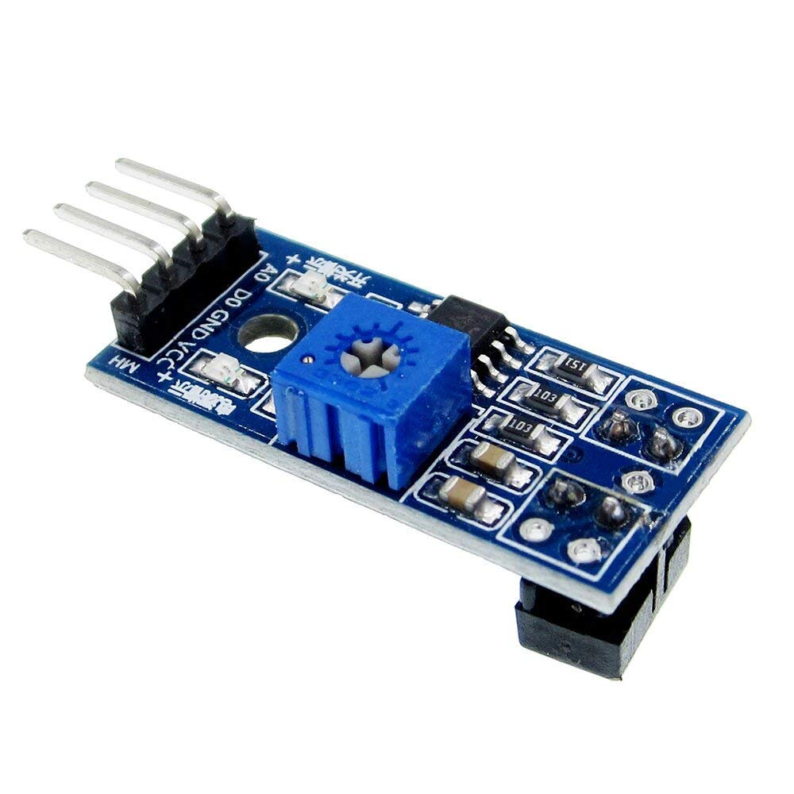

# 10.1 Materiaal

Een **digitale IR-sensor** kijkt of de ondergrond zwart of wit is. Hij stuurt infrarood licht uit en meet hoeveel ervan terugkomt. Wit weerkaatst veel, zwart bijna niets.

Wat heb je nodig?

1. Arduino Nano RP2040 Connect
2. Digitale IR-sensor

Het potmetertje (klein draaitje) op de sensor stelt de **drempel** tussen zwart en wit in.

Controlevraag

Wat geeft een digitale IR-sensor terug?

Antwoord

Alleen een **0** of een **1**. Hij heeft al voor je beslist of wat hij ziet zwart of wit is. Wil je het ruwe getal? Gebruik dan een **analoge** IR-sensor (zie hoofdstuk 11).

