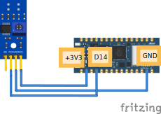
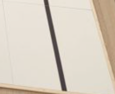

# 10.2 Aansluiten en code

## Aansluiten




Pinnen van de digitale IR-sensor:

- **VCC**: de plus (3,3V)
- **GND**: de min
- **DO**: digitale uitgang

Aansluiten op de Nano RP2040 Connect:

- **VCC** aan **3.3V**
- **GND** aan **GND**
- **DO** aan een digitale pin naar keuze, bijvoorbeeld **D14**

## Code

```python
from time import sleep
from leaphymicropython.sensors.linesensor import read_line_sensor

while True:
    print(read_line_sensor(14))
    sleep(1)
```

In de Shell verschijnt steeds een **0** of een **1**.

## Hoe gebruik je dit bij de RoboCup?

Pak een competitietegel van de RoboCup (welke maakt niet uit):



Houd je IR-sensor boven de tegel. Wanneer geeft `read_line_sensor(14)`:

- de waarde **1**?
- de waarde **0**?

Met een schroevendraaier kun je het potmetertje op de sensor draaien om de overgang van zwart naar wit nauwkeurig in te stellen.

Voor meer informatie: [Redden Basis](/docs/Competities/RoboCup-Junior/Redden-Basis/redden_basis).

<details>
<summary>Opdracht: lampje volgt de lijn</summary>

Laat het ingebouwde rode lampje branden zodra de sensor **zwart** ziet, en uit gaan boven **wit**.

</details>

<details>
<summary>Tip</summary>

Bij de ingebouwde RGB-LED is `value(0)` aan en `value(1)` uit. Welke waarde geeft `read_line_sensor(14)` boven zwart?

</details>

<details>
<summary>Oplossing</summary>

```python
from time import sleep
from machine import Pin
from leaphymicropython.sensors.linesensor import read_line_sensor

led = Pin('LED_RED', Pin.OUT)

while True:
    waarde = read_line_sensor(14)
    if waarde == 0:
        led.value(0)  # AAN boven zwart
    else:
        led.value(1)  # UIT boven wit
    sleep(0.1)
```

Welke waarde "zwart" is, hangt af van hoe je het potmetertje hebt afgesteld. Test eerst met de eenvoudige print-code hierboven.

</details>
