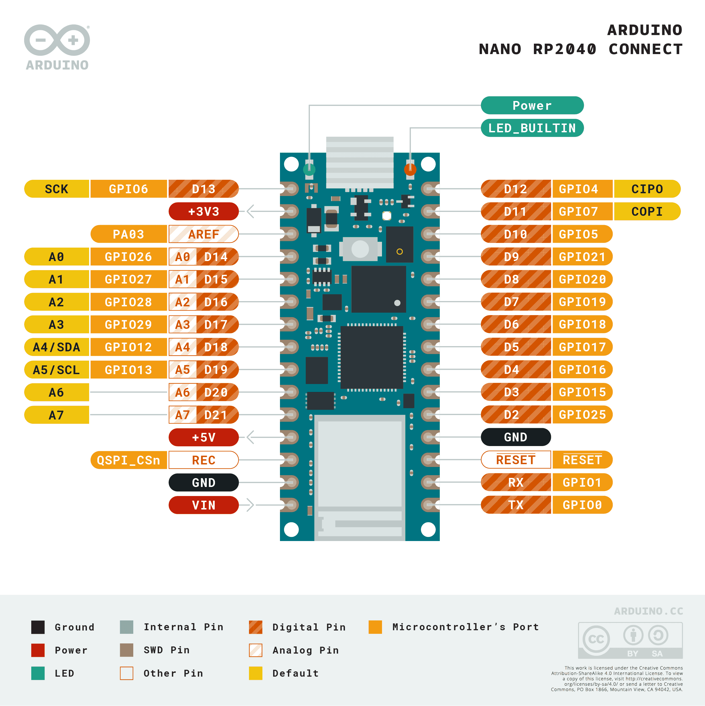

# 1.1 Het bord

Welkom! Je gaat dit project bouwen met de **Arduino Nano RP2040 Connect**. Dat is een klein microcontroller-bord waarop je sensoren en actuatoren kunt aansluiten. Hieronder zie je het bord met al zijn pinnen.

De namen op de afbeelding (zoals `D2`, `A0`, `3.3V`, `GND`) gebruik je later steeds opnieuw als je iets aansluit. Houd deze afbeelding dus bij de hand.

In de volgende stappen verbind je het bord met je computer en zet je MicroPython erop.

Controlevraag

Welke pin gebruik je om een sensor van **3,3V** te voeden?

Antwoord

De pin met de naam **3.3V**. Daar staat altijd 3,3 volt op. Voor de **min** gebruik je een pin die `GND` heet.

