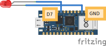

# 3.2 Aansluiten en code

## Aansluiten




Verbind:

- **Lange pin** (plus) van de LED aan **D7**
- **Korte pin** (min) van de LED aan een **GND**-pin

## Code

```python
from machine import Pin

pin_7 = Pin('D7', Pin.OUT)
pin_7.on()
```

Als alles goed is aangesloten, brandt je lampje nu.

## Uitleg

- `Pin('D7', Pin.OUT)` zegt: gebruik pin **D7** als uitgang.
- `.on()` zet de pin op 3,3V, waardoor er stroom door de LED loopt en hij gaat branden.

<details>
<summary>Opdracht: lampje uitzetten</summary>

Hoe zou je het lampje na 1 seconde weer uit zetten?

</details>

<details>
<summary>Oplossing</summary>

```python
from machine import Pin
from time import sleep

pin_7 = Pin('D7', Pin.OUT)
pin_7.on()
sleep(1)
pin_7.off()
```

Met `sleep(1)` wacht je 1 seconde en daarna zet je het lampje uit met `.off()`.

</details>
