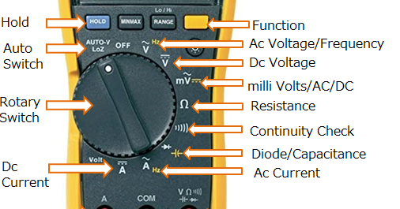

# 4.2 Multimeter: video-uitleg

Vind je het fijner om eerst een video te kijken over hoe een multimeter werkt? Hieronder vind je er een.

<iframe width="853" height="480" src="https://www.youtube.com/embed/36BdxlYx7MY" title="Werken met de multimeter" frameborder="0" allow="accelerometer; autoplay; clipboard-write; encrypted-media; gyroscope; picture-in-picture; web-share" referrerpolicy="strict-origin-when-cross-origin" allowfullscreen></iframe>

Controlevraag

Welke instelling van de multimeter gebruik je om de **3,3V** van je microcontroller te meten?

Antwoord

**DC voltage** (V met een streepje of de letters `DCV`). Microcontrollers werken met gelijkspanning.

