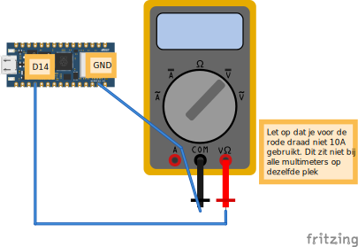

# 4.1 Pin nameten met een multimeter

Soms wil je controleren of een pin echt spanning geeft. Dat doe je met een **multimeter**. Hieronder zetten we pin **D14** afwisselend op 3,3V en op 0V, zodat je het kunt meten.

## Aansluiten




- Rode meetpen aan **D14**
- Zwarte meetpen aan **GND**
- Multimeter op **DC voltage** (V met een streepje)

## Code: pin op HOOG

```python
from machine import Pin
from time import sleep

pin = Pin("D14", Pin.OUT)

while True:
    pin.value(1)  # HIGH = 3,3V
    sleep(1)
```

Op je multimeter zou je nu ongeveer **3,3V** moeten zien.

## Code: pin op LAAG

```python
from machine import Pin

pin = Pin("D14", Pin.OUT)
pin.value(0)  # LOW = 0V
```

Nu moet de multimeter **0V** aangeven.

<details>
<summary>Controlevraag</summary>

Wat zou je meten als je per ongeluk de rode meetpen op **3.3V** zet in plaats van op D14?

</details>

<details>
<summary>Antwoord</summary>

Dan meet je altijd **3,3V**, ongeacht je code. De `3.3V`-pin staat namelijk altijd onder spanning zolang het bord aan staat.

</details>
