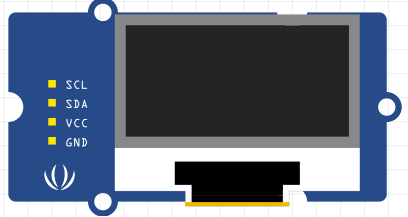

# 15.1 Materiaal

Een **OLED-scherm** laat je tekst en getallen zien op je robot, zonder dat hij aan de laptop hoeft te hangen. Ideaal om sensorwaardes te volgen tijdens het rijden. Het scherm praat via **I2C** (pinnen SDA en SCL).

## Zonder multiplexer

- Arduino Nano RP2040 Connect
- OLED-scherm (128 × 64)

Het uiterlijk verschilt per merk, maar de aansluitingen zijn hetzelfde: **VCC**, **GND**, **SDA**, **SCL**.

## Met multiplexer (aanbevolen)

Heb je ook TOF-sensoren? Gebruik dan een multiplexer zodat alles tegelijk werkt.

- SDA/SCL-module voor het Leaphy Murphy Shield
- 4-pins jumperkabel female/female

Controlevraag

Hoeveel pinnen heeft het OLED-scherm minimaal nodig op de microcontroller?

Antwoord

Vier: **VCC** (3,3V), **GND**, **SDA** (A4) en **SCL** (A5).

