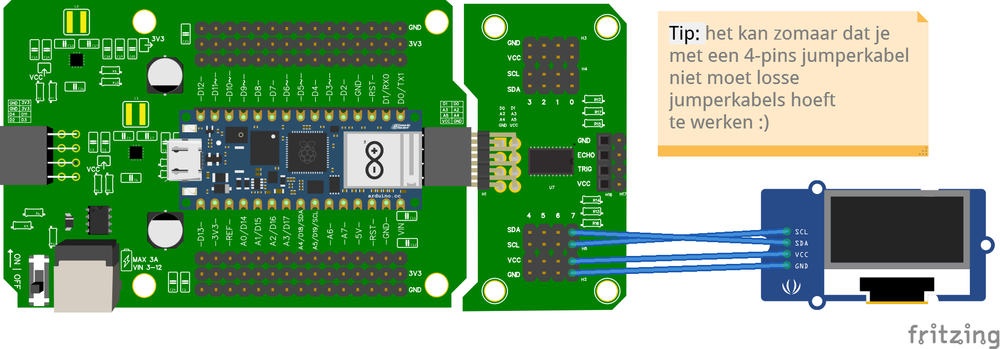

# 15.2 Aansluiten en code (met multiplexer)

## Aansluiten



Sluit het OLED-scherm via een 4-pins jumperkabel aan op de **multiplexer**:

- **VCC** → 3,3V op de multiplexer
- **GND** → GND op de multiplexer
- **SDA** → SDA op channel **7** van de multiplexer
- **SCL** → SCL op channel **7** van de multiplexer

In dit voorbeeld zit het scherm dus op **channel 7**. Steek het in een ander kanaal? Pas dan het getal in de code aan.

## Voorbeeld

```python
from leaphymicropython.actuators.oled_screen import OLEDSH1106

oled = OLEDSH1106(width=128, height=64, channel=7)

oled.fill("white")
oled.text('Hello, World 1!', x=0, y=0)
oled.text('Hello, World 2!', x=0, y=10)
oled.text('Hello, World 3!', x=0, y=20)
oled.show()
```

Op het scherm verschijnen nu drie regels.

## Uitleg

```python
oled = OLEDSH1106(width=128, height=64, channel=7)
```

- **width**: breedte in pixels (128).
- **height**: hoogte in pixels (64).
- **channel**: het channel van de multiplexer waar het scherm op zit.

```python
oled.text('Hallo!', x=0, y=0)
oled.show()
```

- `text()` zet tekst klaar op positie (x, y).
- **`show()`** stuurt alles wat je klaargezet hebt naar het scherm. Vergeet deze niet — anders blijft het scherm leeg.

## Andere handige functies

### Scherm leeg maken

```python
oled.fill("white")  # alles wit
oled.show()
oled.fill("black")  # alles zwart
oled.show()
```

### Een getal tonen

Getallen moet je eerst omzetten naar tekst met **`str()`**:

```python
temperatuur = 22.5
oled.fill("white")
oled.text('Temp: ' + str(temperatuur) + 'C', x=0, y=40)
oled.show()
```

<details>
<summary>Opdracht: teller op het scherm</summary>

Laat het scherm elke seconde een teller een nummer hoger laten zien (0, 1, 2, 3, ...).

</details>

<details>
<summary>Tip</summary>

Maak elke ronde het scherm leeg met `oled.fill("white")` en zet de nieuwe waarde erop met `oled.text(...)`. Vergeet `oled.show()` niet.

</details>

<details>
<summary>Oplossing</summary>

```python
from leaphymicropython.actuators.oled_screen import OLEDSH1106
from time import sleep

oled = OLEDSH1106(width=128, height=64, channel=7)

teller = 0
while True:
    oled.fill("white")
    oled.text('Teller: ' + str(teller), x=0, y=0)
    oled.show()
    teller = teller + 1
    sleep(1)
```

</details>
