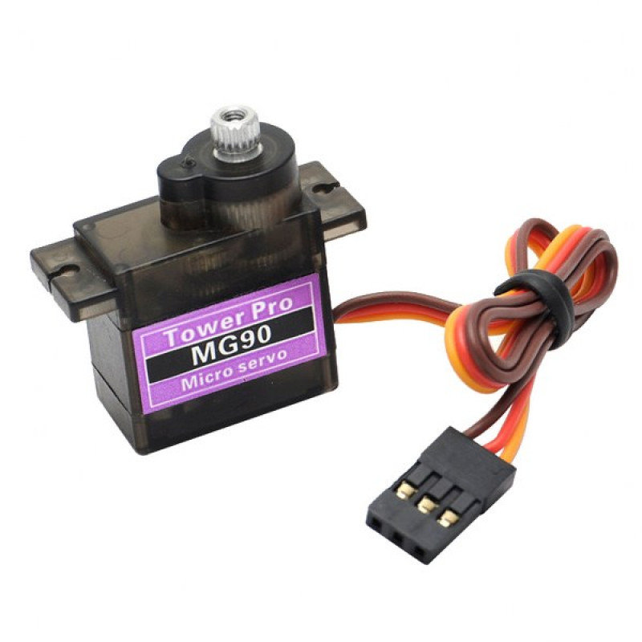

# 7.1 Materiaal

Een **servo-motor** kan naar een precieze hoek draaien (tussen 0 en 180 graden). Handig voor een grijper, een wijzer of een sweepende sensor.

Wat heb je nodig?

1. Arduino Nano RP2040 Connect
2. Servo-motor (180-graden)

De servo heeft drie kabels:

- **Bruin** (of zwart): GND
- **Rood**: VCC (3,3V)
- **Oranje** (of geel): stuursignaal

Controlevraag

Welke kleur kabel gaat naar `3.3V`?

Antwoord

De **rode** kabel. De bruine/zwarte kabel gaat naar `GND` en de oranje/gele kabel naar een digitale pin.

