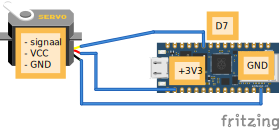

# 7.2 Aansluiten en code

## Aansluiten




- **Bruin** (GND) aan een **GND**-pin
- **Rood** (VCC) aan **3.3V**
- **Oranje** (stuursignaal) aan een digitale pin, bijvoorbeeld **D6**

## Code

```python
from leaphymicropython.actuators.servo import set_servo_angle
from time import sleep

set_servo_angle("D6", 0)
sleep(1)
set_servo_angle("D6", 90)
sleep(1)
set_servo_angle("D6", 180)
```

De servo draait nu naar 0, dan 90 en dan 180 graden.

## Uitleg van `set_servo_angle`

```python
set_servo_angle(pin_name, angle)
```

- **pin_name**: naam van de pin als tekst, met een `D` ervoor: `"D6"`, `"D7"`, ...
- **angle**: een getal tussen **0** en **180** graden.

<details>
<summary>Opdracht: heen en weer zwaaien</summary>

Laat de servo continu heen en weer zwaaien tussen 0 en 180 graden, met 1 seconde tussen elke stand.

</details>

<details>
<summary>Oplossing</summary>

```python
from leaphymicropython.actuators.servo import set_servo_angle
from time import sleep

while True:
    set_servo_angle("D6", 0)
    sleep(1)
    set_servo_angle("D6", 180)
    sleep(1)
```

</details>
