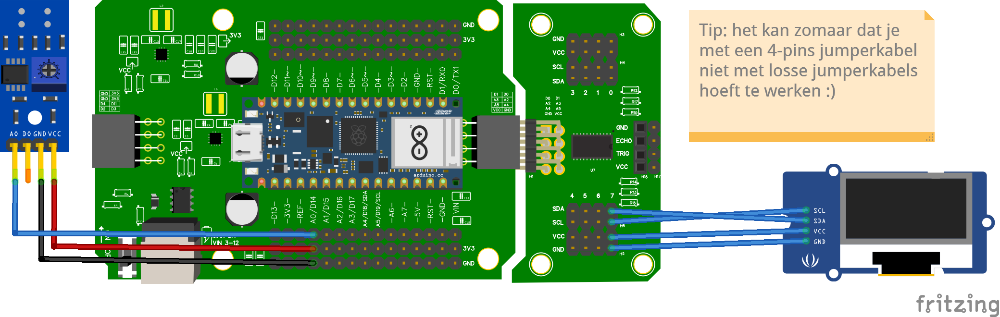

# Sensorwaardes op het scherm

Wanneer je robot los van de laptop rijdt, kun je de Shell niet meer zien. Door waardes op het OLED-scherm te tonen, kun je toch volgen wat je sensoren doen.

:::danger A4 en A5 zijn bezet

Omdat je een multiplexer en OLED-scherm gebruikt, zijn pinnen **A4** en **A5** bezet voor I2C-communicatie. Sluit hier **geen** IR-sensoren op aan. Gebruik alleen **A0, A1, A2, A3, A6** of **A7** voor IR-sensoren.

:::

## Aansluitschema



- IR-sensor op **A0**
- OLED-scherm op **channel 7** van de multiplexer

## Code

```python
from time import sleep
from leaphymicropython.sensors.linesensor import AnalogIR
from leaphymicropython.actuators.oled_screen import OLEDSH1106

a0 = AnalogIR("A0", 2500)
oled = OLEDSH1106(width=128, height=64, channel=7)

while True:
    a0_ir = a0.get_analog_value()
    a0_color = a0.black_or_white()

    oled.fill('white')
    oled.text('Waarde A0 ' + str(a0_ir), 0, 0)
    oled.text('Kleur van A0 ' + a0_color, 0, 10)
    oled.show()
    sleep(0.01)
```

## Uitleg

- Eerst lees je de IR-sensor uit (ruwe waarde + kleur).
- Daarna maak je het scherm leeg (`oled.fill('white')`).
- Vervolgens zet je twee regels tekst op het scherm.
- `oled.show()` stuurt alles naar het scherm — vergeet die regel nooit.

<details>
<summary>Opdracht: twee sensoren op het scherm</summary>

Breid de code uit met een tweede IR-sensor op **A1**. Toon beide waardes onder elkaar.

</details>

<details>
<summary>Oplossing</summary>

```python
from time import sleep
from leaphymicropython.sensors.linesensor import AnalogIR
from leaphymicropython.actuators.oled_screen import OLEDSH1106

a0 = AnalogIR("A0", 2500)
a1 = AnalogIR("A1", 2500)
oled = OLEDSH1106(width=128, height=64, channel=7)

while True:
    oled.fill('white')
    oled.text('A0: ' + str(a0.get_analog_value()) + ' ' + a0.black_or_white(), 0, 0)
    oled.text('A1: ' + str(a1.get_analog_value()) + ' ' + a1.black_or_white(), 0, 10)
    oled.show()
    sleep(0.01)
```

</details>
