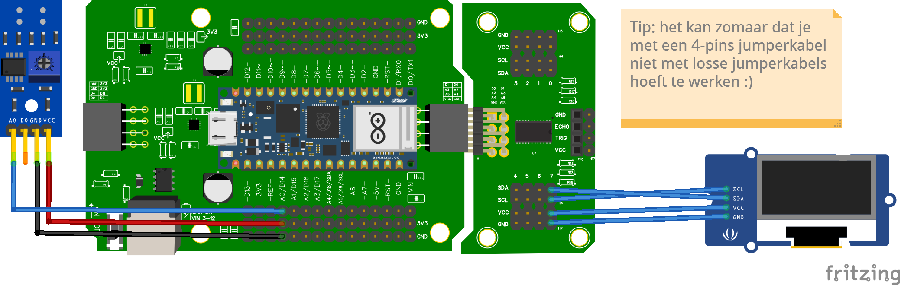

# Het robotscript bouwen — Deel 5: Waardes op het scherm

Straks rijdt je robot los van de laptop, en dan is de Shell weg. Vanaf dat moment is het OLED-scherm je venster in de robot: daar zie je wat de sensoren zien. In dit deel vervang je de `print` door het scherm — en daarmee staat het eerste grote mijlpunt: een robot die zelf laat zien wat hij meet.

:::danger[A4 en A5 zijn bezet]

De multiplexer en het OLED-scherm praten via **I2C**, en dat gebruikt de pinnen **A4** en **A5**. Sluit daar dus **geen** IR-sensoren op aan; gebruik **A0, A1, A2, A3, A6** of **A7**.

:::

## Aansluiten



Het scherm gaat via een 4-pins jumperkabel naar de **multiplexer**: VCC → 3,3V, GND → GND, en SDA/SCL naar channel **7**. Steek je hem in een ander channel, pas dan het getal in je code aan.

## Stap 1: Eerst het scherm alleen

Nieuw onderdeel, dus eerst een minimale test — los van je robotscript:

```python
from leaphymicropython.actuators.oled_screen import OLEDSH1106

oled = OLEDSH1106(width=128, height=64, channel=7)

oled.fill('white')
oled.text('Hallo robot', 0, 0)
oled.show()
```

**`OLEDSH1106(width=128, height=64, channel=7)`** maakt het scherm-object: 128 pixels breed, 64 hoog, op channel 7 van de multiplexer.

Het tekenen gaat altijd in drie stappen: **`fill('white')`** maakt het scherm leeg, **`text(tekst, x, y)`** zet tekst klaar op een positie, en **`show()`** stuurt alles in één keer naar het scherm.

## Voorspel: wat gebeurt er zonder `show()`?

<details>
<summary>Antwoord</summary>

Het scherm blijft leeg. `fill()` en `text()` werken in een kladversie in het geheugen; pas `show()` stuurt die naar het echte scherm. Dit is de vergeten-regel nummer één bij schermen — onthoud hem.

</details>

## Stap 2: Het scherm in je robotscript

Terug naar je script uit Deel 4. De `print`-regel gaat eruit; het scherm komt ervoor in de plaats:

```python
from time import sleep
from leaphymicropython.sensors.linesensor import AnalogIR
from leaphymicropython.actuators.oled_screen import OLEDSH1106

links = AnalogIR("A0", 2500)
rechts = AnalogIR("A1", 2500)
oled = OLEDSH1106(width=128, height=64, channel=7)

while True:
    kleur_links = links.black_or_white()
    kleur_rechts = rechts.black_or_white()

    oled.fill('white')
    oled.text('Links: ' + kleur_links, 0, 0)
    oled.text('Rechts: ' + kleur_rechts, 0, 10)
    oled.show()
    sleep(0.2)
```

Let op de opbouw die je al kent: het scherm-object staat bóven de loop (eenmalig klaarzetten), het tekenen zit erin (elke ronde opnieuw). De tweede regel staat op `y=10`, tien pixels lager — anders schrijven de twee regels door elkaar heen.

## Test het

Beweeg de robot boven de lijn. Het scherm toont `Links:` en `Rechts:` en wisselt live mee tussen `white` en `black` — zonder dat je nog naar de Shell hoeft te kijken.

## Opdracht 6.4.a: een teller op het scherm

Nog even los van je robotscript: laat het scherm elke seconde een teller zien die één hoger wordt (0, 1, 2, 3, …).

<details>
<summary>Klik hier voor een tip.</summary>

Je hebt een variabele nodig die boven de loop op `0` begint en er in de loop `1` bij krijgt. Het scherm kan alleen tekst tonen, dus zet het getal om met `str()`.

</details>

<details>
<summary>Klik hier voor de oplossing.</summary>

```python
from time import sleep
from leaphymicropython.actuators.oled_screen import OLEDSH1106

oled = OLEDSH1106(width=128, height=64, channel=7)
teller = 0

while True:
    oled.fill('white')
    oled.text('Teller: ' + str(teller), 0, 0)
    oled.show()
    teller = teller + 1
    sleep(1)
```

`teller = teller + 1` is het patroon voor alles wat moet oplopen; `str(teller)` maakt er tekst van, want `text()` accepteert geen kaal getal.

</details>

## Je script tot nu toe

<details>
<summary>Klik hier om te vergelijken</summary>

```python
from time import sleep
from leaphymicropython.sensors.linesensor import AnalogIR
from leaphymicropython.actuators.oled_screen import OLEDSH1106

links = AnalogIR("A0", 2500)
rechts = AnalogIR("A1", 2500)
oled = OLEDSH1106(width=128, height=64, channel=7)

while True:
    kleur_links = links.black_or_white()
    kleur_rechts = rechts.black_or_white()

    oled.fill('white')
    oled.text('Links: ' + kleur_links, 0, 0)
    oled.text('Rechts: ' + kleur_rechts, 0, 10)
    oled.show()
    sleep(0.2)
```

</details>

## Er gaat iets mis

<details>
<summary>Het scherm blijft helemaal leeg</summary>

**Oorzaak:** `show()` ontbreekt, het scherm zit op een ander channel dan je code zegt, of de kabel zit los.

**Oplossing:**

1. Controleer dat er ergens in je loop `oled.show()` staat.
2. Kijk op de multiplexer bij welk channel de kabel echt zit en vergelijk met `channel=7`.

**Zelf vinden:** zet een `print("teken")` naast `oled.show()`. Verschijnt die regel wél in de Shell, dan draait je code en zit het bij het scherm of de kabel; verschijnt hij niet, dan komt je code daar nooit.

</details>

<details>
<summary>Oude tekst blijft op het scherm staan of schuift door elkaar</summary>

**Oorzaak:** `oled.fill('white')` ontbreekt, waardoor elke ronde óver de vorige heen tekent.

**Oplossing:** Begin elke tekenronde met `oled.fill('white')`: eerst schoonvegen, dan schrijven.

</details>

<details>
<summary>Foutmelding zodra je een getal op het scherm wilt zetten</summary>

**Oorzaak:** `text()` accepteert alleen tekst, geen kaal getal.

**Oplossing:** Zet het getal eerst om: `oled.text('Waarde: ' + str(meting), 0, 0)`.

</details>

<details>
<summary>Controlevraag</summary>

Waarom staat er `y=10` bij de tweede tekstregel?

</details>

<details>
<summary>Antwoord</summary>

De y is de hoogte in pixels waarop de tekst begint. Twee regels op dezelfde y schrijven dwars door elkaar heen; tien pixels verschil zet ze netjes onder elkaar.

</details>

---

← [Deel 4 — Twee sensoren](../analoog_ir/deel4_twee_sensoren.md) · **Volgende:** [de motoren](../motoren/doel.md) →
